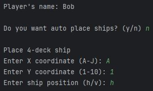
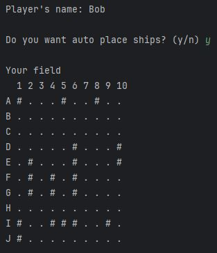
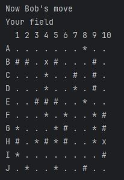
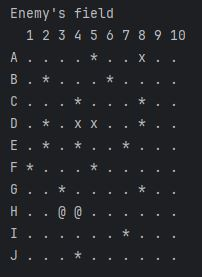
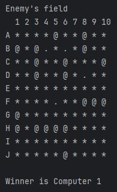

# Морской бой (консольная версия)

Данный проект представляет собой консольную реализацию классической игры "Морской бой". 
Игроки по очереди делают ходы, пытаясь потопить корабли противника, скрытые на его игровом поле.

## Параметры игры
- Поле 10x10;
- Корабли (10 шт.):
  - Четырехпалубный - 1 шт.;
  - Трехпалубный - 2 шт.;
  - Двухпалубный - 3 шт.;
  - Однопалубный - 4 шт.

## Режимы игры
- Игрок vs Игрок;
- Игрок vs Компьютер;
- Компьютер vs Компьютер.

## Способы расстановки
- Ручной;
- Автоматический.

## Процесс игры
### 1 этап: Расстановка кораблей
Каждый игрок расставляет корабли на поле. 
Для человека доступен выбор из ручной или автоматической расстановок:

    
    

### 2 этап: Ход
Каждый игрок поочередно наносит удары по полю противника.
Компьютер выбирает цель случайно, т.е. имеет минимальный уровень сложности.  

Игрок видит собственное поле следующим образом:

Поле противника выглядит следующим образом:

Условные обозначения:
- `.` - пусто;
- `#` - корабль;
- `*` - мимо;
- `x` - ранен;
- `@` - убит.

## Конец игры
Побеждает тот, кто первым затопит все корабли противника:

